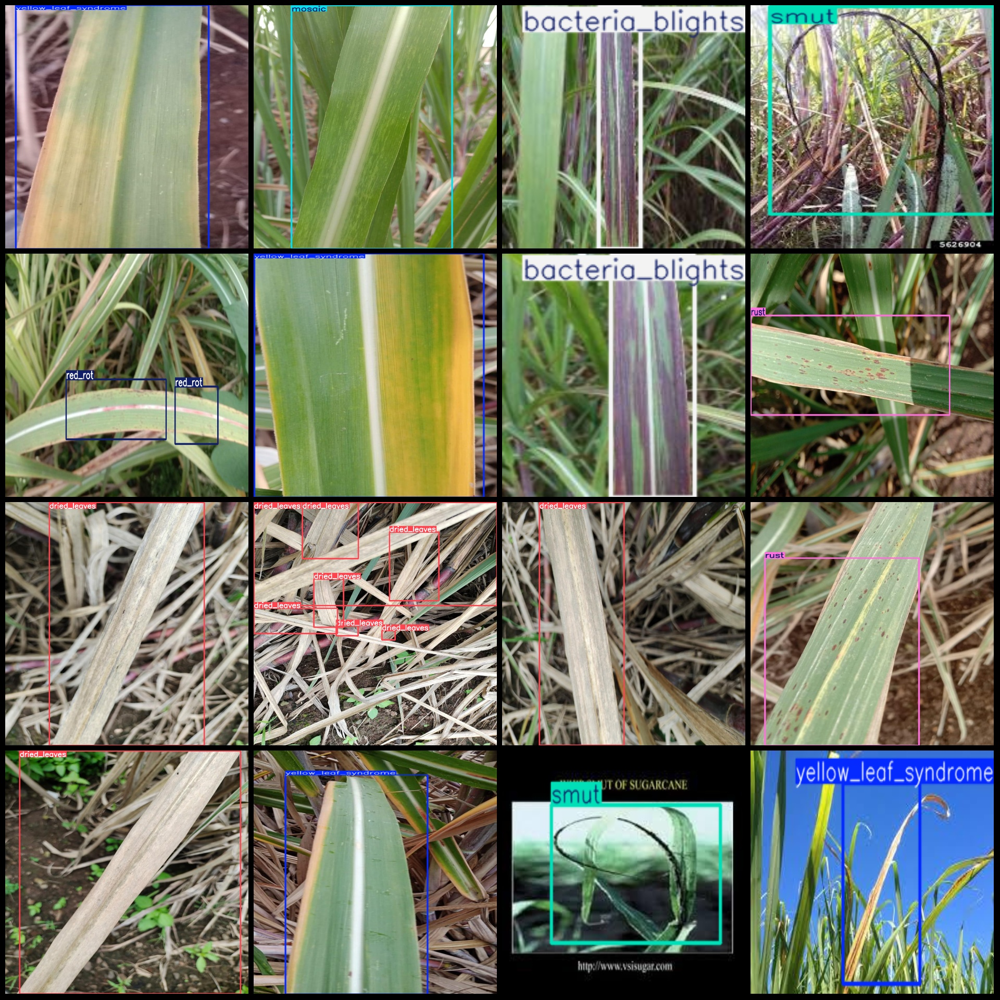
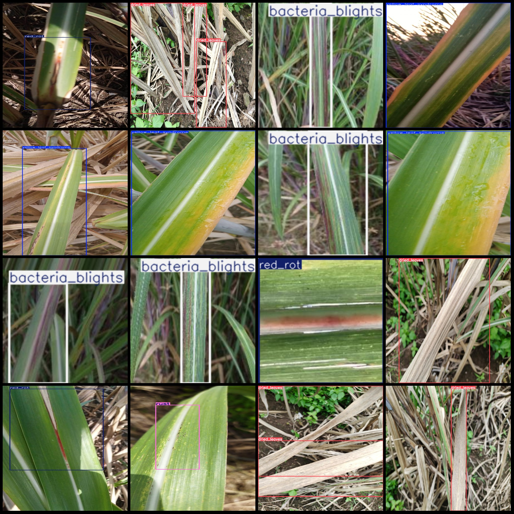

# Agricultural Disease Detection Dataset for Sugarcane Leaves in VOC+YOLO format, 1248 images, 15 categories

Dataset format: Pascal VOC format + YOLO format (txt file without split path, only contain jpg image and corresponding VOC format xml file and yolo format txt file)
number of images: 1248  
annotation count: 1248  
annotation count: 1248  
annotationnumber of classes: 15  
annotation class names: ["bacteria_blights", "brown_spot", "downey_mildew", "dried_leaves", "leaf_scald", "leaf_scorch", "mosaic", "pokkah_boeng", "red_rot", "red_spot", "ring_spot", "rust", "smut", "yellow_leaf_syndrome", "yellow_spot"]
Number of boxes annotated for each category:
Bacterial Blights (191) with 176 images.
Brown spot (brown patch) frame count = 18, occupied picture count = 16
Downey mildew (mildew) frame count = 24, occupy picture count = 18
Dried leaves (dry leaves) frame count = 265, picture count = 186
Leaf scald (Leaf scald) box count = 15, images = 9
Leaf scorch (Leaf scorch) box count = 12, images = 10
Mosaic (Mosaic virus) box count = 187, images = 176
Pokkah boeng (Potato leafroller) box count = 24, images = 16
Frames = 250, Pictures = 216
Number of red spots (erythema) frames = 6, Number of frames occupied by the image = 3.
Ringspot (ring spot) box count = 46, images = 36
Rust (rust) box count = 152, images = 148
Smut (black-smut) box count = 42, images = 36
The yellow leaf syndrome (yellow leaf syndrome) frame count = 211, occupying picture count = 197.
Number of frames with "yellow spot" = 24, Number of frames in the image = 24
Total frames: 1467
Image resolution: Multi-resolution images, such as 180x180, 493x986, etc.
Use annotation tools: labelImg
Rules for Annotation: Mark the category with a rectangle.
Important notes: The dataset does not have separate training, validation, or test sets. You must partition them yourself. 
Special statement: This dataset does not guarantee the accuracy of the trained models or weight files.
Preview of images:
## Images

Here is a pay link on Stripe ( https://buy.stripe.com/3cs8yP7sY87d0vu9AB ). Please contact me lonlonago@foxmail.com after funding $89, and I will send you a complete data files , thank you!

